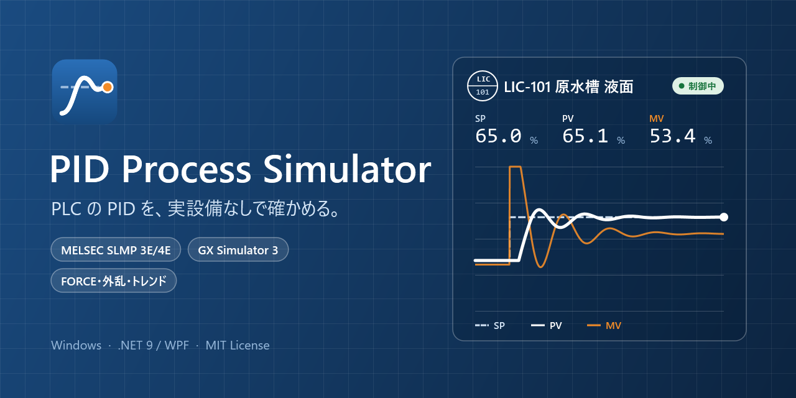
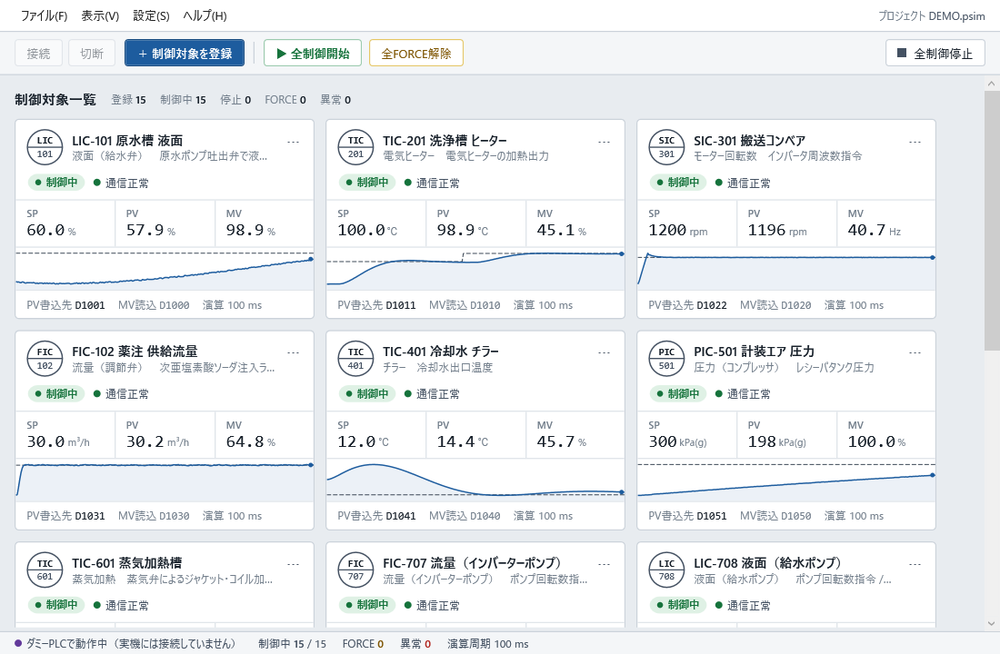
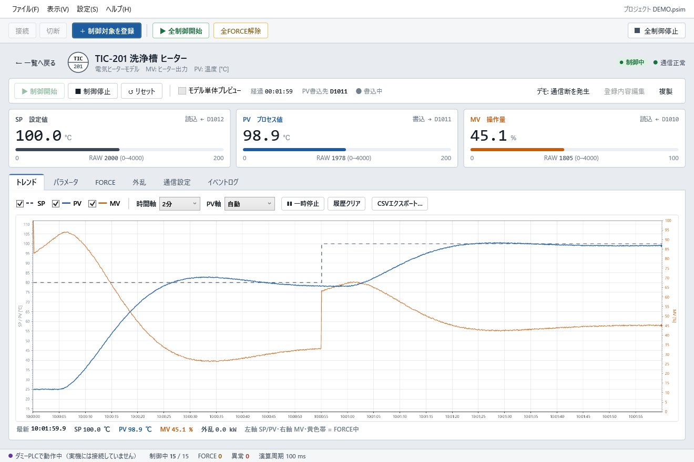

# PID Process Simulator

PLC上のPID制御を、実設備なしで試すためのWindowsアプリです。
PLCからMV（操作量）を受け取り、タンクの温度・液面・流量などの応答を計算して、PV（プロセス値）をPLCへ返します。ダミーPLCを使えば、このアプリだけで試せます。

## ダウンロード・起動

1. [GitHub Releases](https://github.com/fa-yoshinobu/plc-pid-simulator-dotnet/releases) からWindows x64版のZIPをダウンロードします。
2. ZIPを展開し、`PidSimulator.exe` を起動します。`DEMO.psim` は同じフォルダに置いてください。

Windows 10 / 11（64ビット）で動作します。.NETの追加インストールは不要です。VirusTotalの検査結果は、各リリースのリンクから確認できます。

## はじめ方

**まず試す場合**は「ファイル → DEMOを開く」を選び、「全制御開始」を押します。15種類のモデルをダミーPLCで動かせます。DEMOを変更して保存するときは、別の名前を付けます。

**自分の試験を作る場合**は、空の初期画面から次の順に設定します。

1. **通信設定**：ダミーPLC、MELSEC PLC（SLMP）、KEYENCE PLC（Host Link）、Modbus TCPから接続先を設定します。GX Simulator 3・KV STUDIOシミュレーターにも接続できます。
2. **制御対象を登録**：モデル、名称、レンジ、PLCのMV・PV・SPアドレスを設定します。
3. **条件から計算**：対象の「パラメータ」で、水量・温度・流量などの設備条件からモデルを設定します。
4. **全制御開始**：PLCと接続して試験を開始し、トレンドで応答を確認します。

接続設定の保存だけでは通信を開始しません。「全制御開始」は未接続なら接続してから開始します。

詳しい接続・操作手順は [使い方](docs/usage.md) を参照してください。

## 主な機能

- 複数の制御対象を同時に実行し、対象ごとに開始・停止・リセット。
- 設備条件からパラメータを求めるウィザードと、PLCなしのモデル単体プレビュー。
- 連続値MVとリレーON/OFF入力。FLOAT32の小数、周波数などモデルに合うMV単位、液面のmm表示。
- SP・PV・MVのトレンド、FORCE、即時・時間指定の外乱投入。
- プロジェクトの保存・読込、イベントログ、トレンドのCSV出力。

| 分類 | モデル |
| --- | --- |
| 回転数 | モーター（時定数・加減速／慣性・トルク） |
| 流量 | 調節弁、インバーターポンプ |
| 液面 | 給水弁、排水弁、給水ポンプ、排水ポンプ |
| 温度 | 電気ヒーター、蒸気加熱、チラー、冷却水弁 |
| 圧力 | コンプレッサ、供給弁、排気弁、インバーターポンプ |

## 画面

| 制御対象一覧 | 制御詳細・トレンド |
| --- | --- |
|  |  |

## 資料

- [使い方・PLC接続](docs/usage.md)
- [制御パターンの選び方](docs/control-patterns.md)
- [モデルの計算](docs/models.md)
- [設備条件からのパラメータ計算](docs/parameter-calculator.md)
- [仕様](docs/specification.md)・[変更履歴](CHANGELOG.md)

開発者向け：[ビルド・開発](docs/build.md)・[リリース手順](docs/releasing.md)

## ライセンス

[MIT License](LICENSE)
